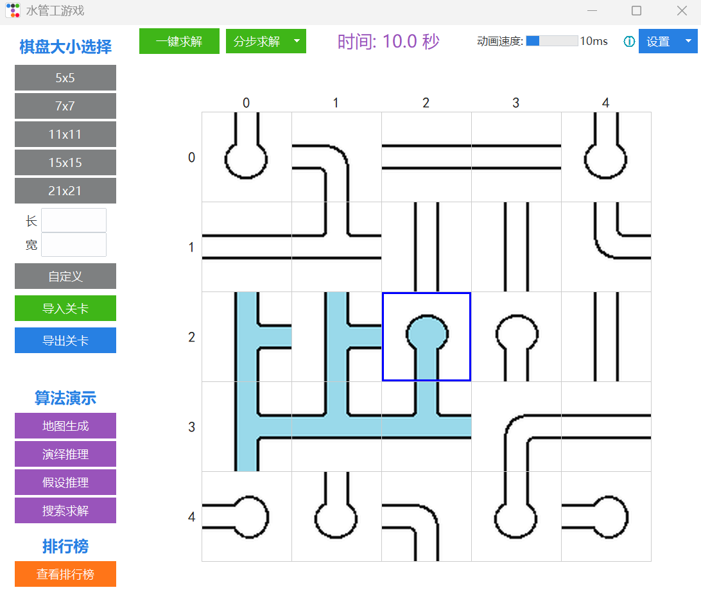
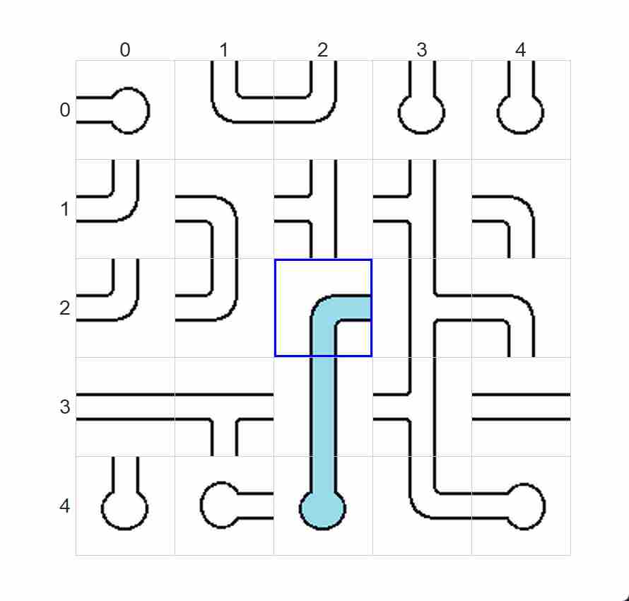
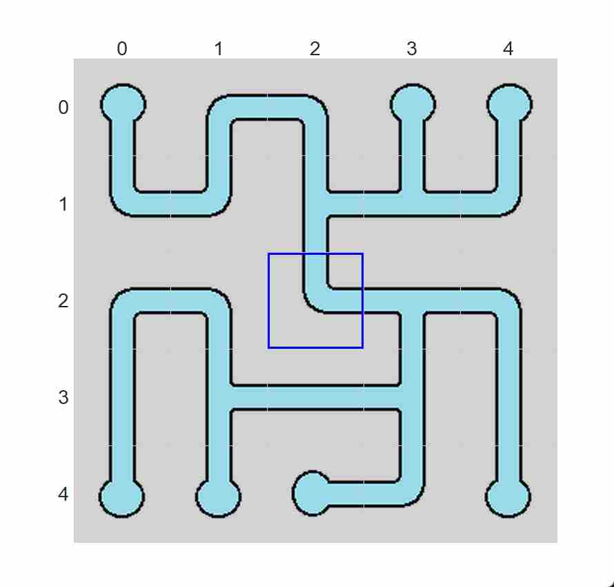
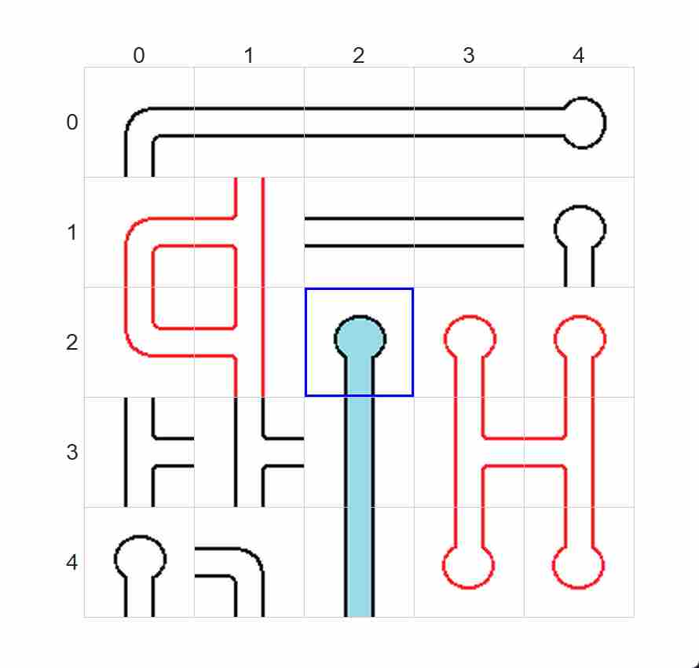
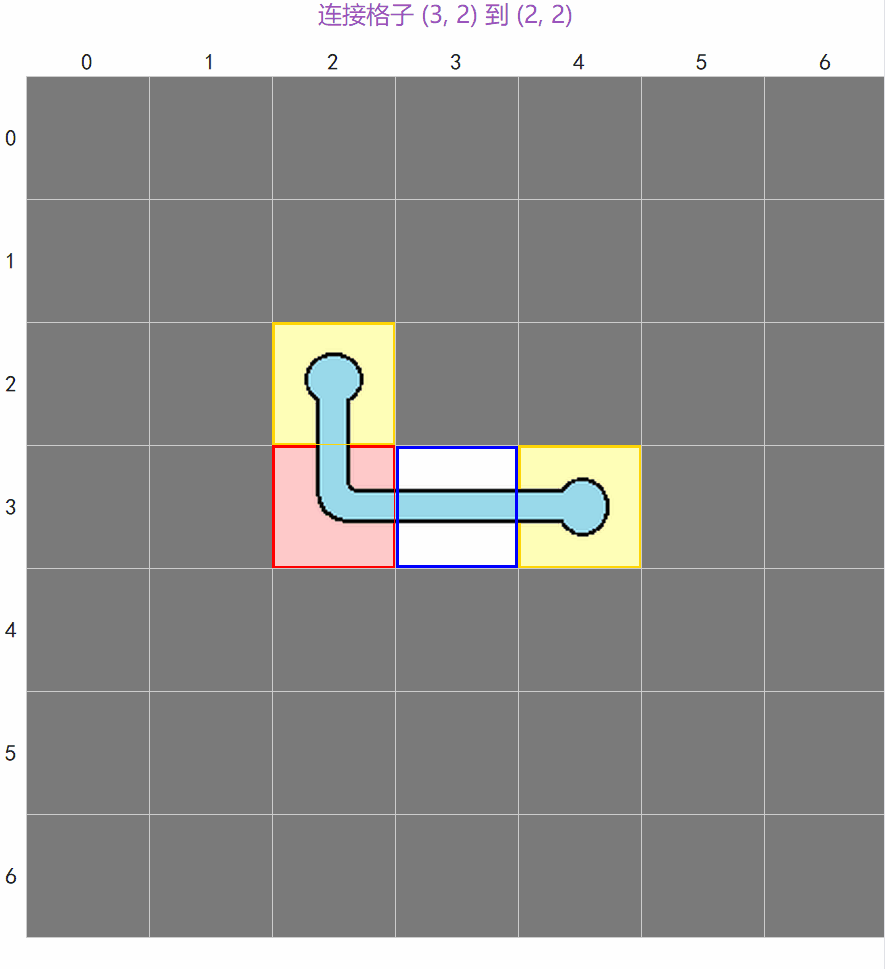
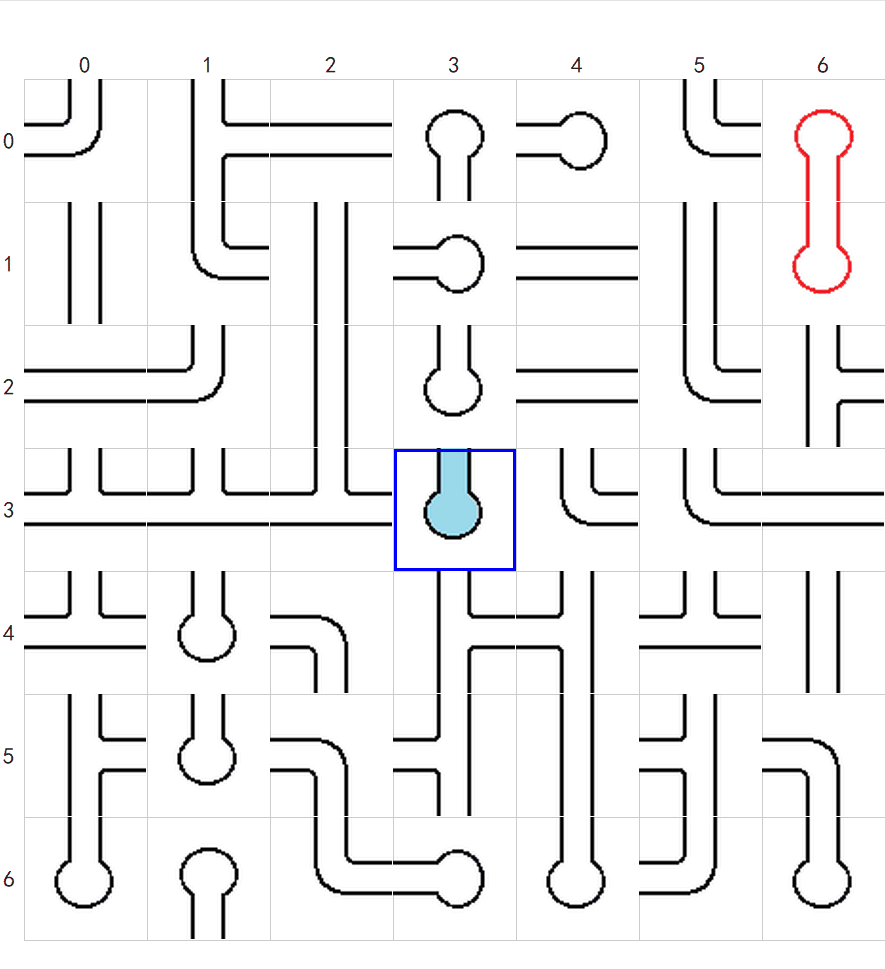
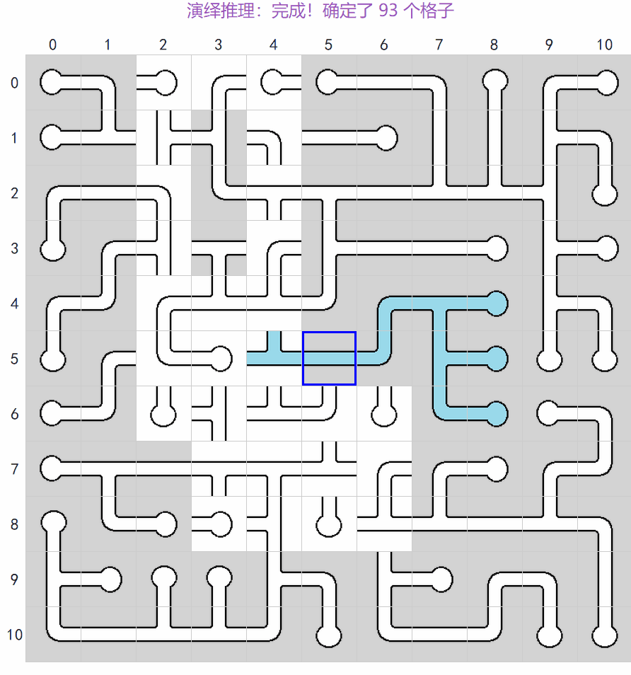
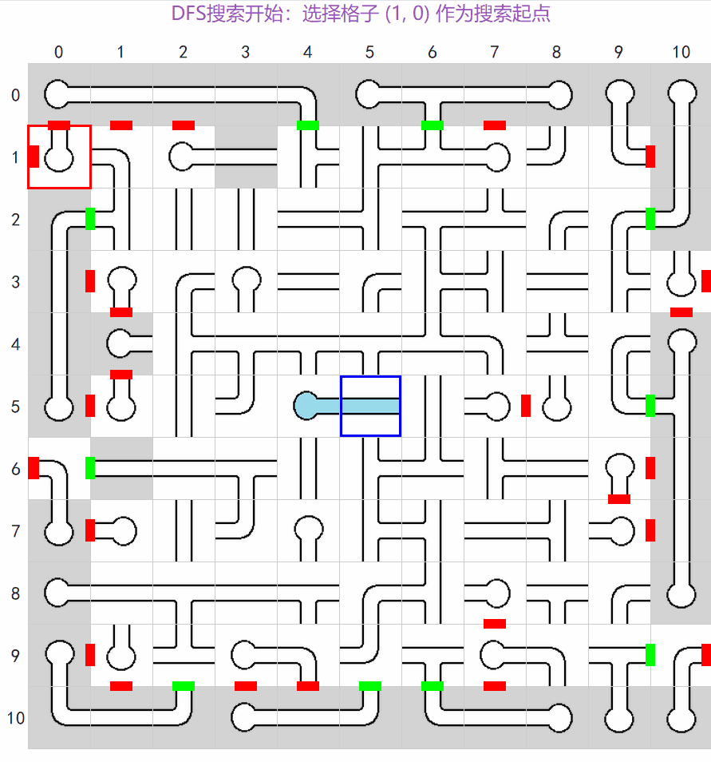

# 水管工游戏 (Pipe Puzzle)

水管工是一个经典的逻辑解谜益智游戏，目标是通过旋转管道，让水流从起点出发，连通所有格子并到达每一个终点，且无断路和环路。

<p align="center">
  
</p>

## 🎮 游戏目标

点击旋转管道格子，使所有管道从水源出发形成一条连通的路径，最终填满整个棋盘。

- 水源位置用蓝色边框格子标记
- 有水流过的管道会显示蓝色
- 所有格子必须被水流填满且不形成环路才能获胜

## 📸 关卡截图

### 刚生成的关卡

<p align="center">
  
</p>

刚生成的关卡，管道方向随机排列，需要玩家旋转调整。

### 通关的关卡

<p align="center">
  
</p>

通关状态！所有管道连通，水流填满整个棋盘。

### 环路与闭路

<p align="center">
  
</p>

- **环路**：水流形成循环，违反规则，不能出现
- **闭路**：管道形成封闭区域，水流无法到达

环路和闭路都会导致无法通关！

## 🖱️ 操作说明

- **左键点击**：旋转管道格子（顺时针90度）
- **右键点击**：锁定/解锁格子（锁定后无法旋转）
- **滚轮**：上下滚动棋盘（长条棋盘时有效）

## 🔧 功能按钮

- **再来一局**：重新生成当前大小的关卡
- **棋盘大小**：选择不同尺寸的棋盘
- **导入/导出关卡**：可自由设计关卡
- **地图生成**：观看关卡生成算法的动画演示
- **演绎推理/假设推理/搜索求解**：观看不同求解算法的动画演示
- **一键求解**：自动完成当前关卡
- **拖拽滑块**：调整动画播放速度
- **查看排行榜**：查看个人最佳成绩

---

# 🧠 算法详解

## 游戏建模

### 问题本质

水管工游戏的本质是**树结构问题**。一个合法的关卡解必须满足：

1. **连通性**：从水源出发，水流能到达所有格子
2. **无环路**：水流路径形成一棵树，而非图
3. **全覆盖**：每个格子恰好被访问一次

从数学角度看，这等价于在网格图上寻找一棵**生成树**，其中：
- 水源是树的根节点
- 每个格子的管道类型由其在树中的度数决定
- 边界格子的开口方向受棋盘边界约束

### 状态表示

在求解算法中，我们使用以下数据结构表示游戏状态：

```python
# 候选集：每个格子的可能旋转状态
candidates = [[set(range(4)) for _ in range(cols)] for _ in range(rows)]

# 方向状态：每个格子四个方向的确定状态 (True/False/None)
dir_state = [[[None for _ in range(4)] for _ in range(cols)] for _ in range(rows)]
```

- **候选集**：记录每个格子可能的旋转角度（0°, 90°, 180°, 270°）
- **方向状态**：记录每个格子四个方向是否确定为开口/非开口/未确定

---

## 关卡生成算法

### 随机BFS树生成

关卡生成的核心是生成一棵覆盖所有格子的树结构。本游戏采用**随机BFS算法**，其特点是从水源出发，维护一个活跃边界集合，每次随机选择一个边界格子进行扩展。

### 动画演示

<p align="center">
  
</p>

**动画说明**：
- **红色边框 + 浅红色填充**：当前正在检查的叶子节点
- **黄色边框 + 浅黄色填充**：待检查的叶子节点集合（活跃边界）
- **蓝色边框**：水源位置
- **灰色填充**：尚未生成的格子

#### 算法流程

```
1. 初始化：将水源标记为已访问，根据水源类型确定初始开口
2. 将水源的邻居加入活跃边界集合
3. 循环直到所有格子被访问：
   a. 从活跃边界中随机选择一个格子
   b. 检查该格子的度数是否已满（最大3）
   c. 随机选择一个未访问的邻居，建立连接
   d. 新格子加入活跃边界
   e. 如果当前格子度数已满或无未访问邻居，从活跃边界移除
4. 根据邻居关系确定每个格子的管道类型
5. 随机旋转每个格子，打乱初始状态
```


#### 纯BFS/DFS的局限性

经过实验发现，纯BFS或DFS生成算法存在以下问题：

1. **直线过多**：在大棋盘上，BFS倾向于让活跃边界"并排走"，导致生成的关卡出现大量长直线
2. **接口数量少**：纯搜索算法生成的树结构往往较为规整，T型管道（接口数3）出现概率低
3. **难度偏低**：接口数量少，关卡过于简单

#### 本游戏的改进方案

通过**随机选择活跃边界格子**而非严格按BFS/DFS顺序，使得生成过程兼具两种策略的特点：
- 避免了纯BFS的"层状扩展"导致的直线问题
- 避免了纯DFS的"深度优先"导致的蛇形路径
- 增加了T型管道的出现概率，提高关卡难度

---

## 求解算法

求解算法分为三个层次，层层递进：

```
演绎推理 → 假设推理 → DFS回溯搜索
(快速)     (中等)      (慢但完备)
```

### 一、演绎推理

演绎推理是一种**确定性推理**，通过约束传播逐步确定每个格子的旋转状态。

#### 核心思想

每个格子的旋转状态受到多重约束：

1. **边界约束**：棋盘边界的格子不能向边界外开口
2. **邻居约束**：如果邻居某方向确定为开口/非开口，则本格子对应方向必须为开口/非开口
3. **候选集约束**：如果某方向在所有候选旋转中都为开口/非开口，则该方向确定为开口/非开口

### 动画演示：演绎推理

<p align="center">
  
</p>

**动画说明**：
- **红色边框**：当前正在推理检查的格子
- **绿色小矩形**：方向状态确定为"有开口"（该方向必须连通）
- **红色小矩形**：方向状态确定为"无开口"（该方向必须封闭）
- **灰色背景**：已确定旋转状态的格子
- **蓝色边框**：水源位置

#### 算法流程

```
1. 初始化候选集（每个格子4种旋转可能）
2. 应用边界约束，排除导致边界开口的旋转
3. 迭代直到稳定：
   a. 根据候选集更新方向状态
   b. 根据方向状态排除候选
   c. 传播方向状态到邻居
4. 检查是否有矛盾（候选集为空）
```

#### 局限性

演绎推理是一种**局部推理**，只能确定"必然"的旋转状态。当棋盘较大时，这种基于规则的确定性推理会达到**稳定状态**——无法再确定更多格子，但仍有未确定的格子。

| 棋盘大小 | 演绎推理可解决比例 |
|---------|------------------|
| 5×5 | ~100% |
| 7×7 | ~90% |
| 11×11 | ~80% |
| 15×15 | ~70% |
| 21×21 | ~50% |

#### 动画算法与求解器算法的差异

需注意，本游戏提供两种演绎推理实现：

| 特性 | 动画版演绎推理 | 求解器演绎推理 |
|------|--------------|--------------|
| 迭代方式 | 逐格子更新 | 批量更新 |
| 更新频率 | 每步更新UI | 稳定后更新 |
| 速度 | 较慢 | 较快 |
| 可视化 | 清晰展示推理过程 | 有冗余动作 |
| 用途 | 教学/演示 | 实际求解 |

动画版算法更符合人类玩游戏时的推理路径，适合展示；求解器版算法经过优化，速度更快，适合实际求解。

---

### 二、假设推理

当演绎推理达到稳定状态后，需要对未确定的格子进行**假设试探**。

#### 核心思想

对于某个未确定的格子，假设其旋转状态为某个候选值，然后运行演绎推理：
- 如果产生矛盾，则排除该候选
- 如果无矛盾，保留该候选
- 如果只剩一个候选，则确定该格子的旋转状态

### 动画演示：假设推理

<p align="center">
  
</p>

**动画说明**：
- **红色边框**：当前正在检查的格子
- **黄色边框**：假设目标格子（正在测试中）
- **绿色边框**：假设目标格子（已确定）
- **绿色小矩形**：方向状态确定为"有开口"
- **红色小矩形**：方向状态确定为"无开口"
- **灰色背景**：已确定旋转状态的格子
- **蓝色边框**：水源位置

#### 算法流程

```
1. 运行演绎推理直到稳定
2. 选择一个未确定的格子
3. 对该格子的每个候选旋转：
   a. 保存当前状态
   b. 假设该旋转
   c. 运行演绎推理
   d. 检查是否产生矛盾（环路、闭路、候选集为空）
   e. 如果矛盾，回溯并排除该候选
   f. 恢复状态，测试下一个候选
4. 如果只剩一个候选，确定该格子
5. 重复步骤1-4直到所有格子确定或失败
```

#### 矛盾检测

假设推理中需要检测以下矛盾：

1. **候选集为空**：如果某个格子的所有候选旋转都被排除，说明当前假设路径存在矛盾
2. **环路检测**：检测是否存在环路，包括有水环路（水流形成闭环）和无水环路（无水流区域形成闭环）
3. **闭路检测**：检测是否存在不与水源连通的封闭区域，这种区域无法获得水流

当检测到以上任一矛盾时，说明当前假设是错误的，需要回溯并排除该候选。

#### 为什么需要假设推理？

后续会介绍升级版的假设推理，即DFS回溯搜索。既然有DFS回溯搜索，为什么还需要假设推理？

**答案：效率。**

当棋盘较大时，DFS的时间复杂度呈指数增长。假设推理的作用是**快速排除大部分错误方向**，只将剩余的少量不确定情况交给DFS处理。

| 棋盘大小 | 纯DFS耗时 | 假设推理+DFS耗时 |
|---------|----------|-----------------|
| 21×21 | ~20秒 | ~2秒 |
| 50×50 | ~3分钟 | ~5秒 |

---

### 三、DFS回溯搜索

当假设推理也无法完全求解时，使用**深度优先搜索**进行完备性求解。

#### 核心思想

DFS是连续套用多层假设推理：不断进行"假设→演绎→回溯"的过程，直到找到完整解或穷尽所有可能。

```
一个DFS深度 = 一次假设
假设 → 演绎推理 → (矛盾则回溯 / 无矛盾则继续假设)
```

### 动画演示：搜索求解

<p align="center">
  
</p>

**动画说明**：
- **红色边框**：当前正在检查的格子
- **黄色边框**：当前DFS搜索假设的格子
- **黄绿色边框**：历史假设路径（已回溯或确定的假设）
- **绿色小矩形**：方向状态确定为"有开口"
- **红色小矩形**：方向状态确定为"无开口"
- **灰色背景**：已确定旋转状态的格子
- **蓝色边框**：水源位置

#### 算法流程

```
1. 运行演绎推理直到稳定
2. 如果所有格子确定，返回成功
3. 选择候选数最少的未确定格子（启发式）
4. 对该格子的每个候选旋转：
   a. 保存当前状态（入栈）
   b. 假设该旋转
   c. 运行演绎推理
   d. 如果矛盾，回溯（出栈），尝试下一个候选
   e. 如果无矛盾，递归调用步骤2
5. 如果所有候选都失败，返回失败（触发上层回溯）
```

#### 启发式策略

选择**候选数最少**的未确定格子进行假设，这样可以：
- 减少分支因子
- 更快发现矛盾
- 提高搜索效率

#### 完备性保证

DFS搜索是**完备的**——只要关卡有解，就一定能找到解。这是因为：
1. 每个格子的候选集有限（最多4个）
2. 搜索会穷尽所有可能的组合
3. 矛盾检测确保不会遗漏正确解

---

## 算法对比总结

| 算法 | 类型 | 时间复杂度 | 适用场景 |
|------|------|-----------|---------|
| 演绎推理 | 确定性推理 | O(n²) | 小棋盘、初始化推理 |
| 假设推理 | 启发式搜索 | O(n² × k) | 中等棋盘 |
| DFS搜索 | 完备性搜索 | O(4^n) | 大棋盘最后一步 |

**三阶段协同工作流程**：

```
┌─────────────┐
│  演绎推理   │ ──→ 快速确定必然状态
└──────┬──────┘
       ↓ 达到稳定
┌─────────────┐
│  假设推理   │ ──→ 排除大部分错误方向
└──────┬──────┘
       ↓ 仍有未确定
┌─────────────┐
│  DFS搜索    │ ──→ 完备性求解
└─────────────┘
```
所有以上动画均可在游戏内实时展示。

---

## 项目结构

```
PipePuzzle/
├── main.py                      # 程序入口
├── game.py                      # 游戏核心状态与胜利检测
├── ui.py                        # 用户界面
├── constants.py                 # 方向常量和管道符号定义
├── level_generator.py           # 关卡生成器
├── level_solver.py              # 关卡求解器
├── leaderboard.py               # 排行榜管理
├── requirements.txt             # Python依赖包
├── pipe_puzzle.spec             # PyInstaller打包配置
├── README.md                    # 项目说明文档
├── animated_solvers/            # 动画求解器模块
│   ├── __init__.py
│   ├── animated_deductive_solver.py  # 演绎推理动画
│   ├── animated_assumption_solver.py # 假设推理动画
│   └── animated_search_solver.py     # 搜索求解动画
├── animated_generators/         # 动画生成器模块
│   ├── __init__.py
│   └── animated_generator.py    # 关卡生成动画
├── images/                      # 图片资源（管道图片、教程图片等）
└── dist/                        # 打包输出目录
    └── pipe_puzzle.exe          # 可执行文件
```

## 运行要求

- Python 3.6+
- tkinter（Python标准库）
- Pillow（图片处理）
- ttkbootstrap（UI美化）

## 安装依赖

```bash
pip install -r requirements.txt
```

或手动安装：
```bash
pip install Pillow ttkbootstrap
```

## 如何运行

### 从源码运行
```bash
python main.py
```

### 运行打包版本
直接运行 `dist/pipe_puzzle.exe`

## 配置文件存储

游戏配置文件和排行榜数据存储在用户目录中：

**Windows**: `C:\Users\用户名\AppData\Roaming\PipePuzzle\`
- `settings.json` - 用户设置
- `leaderboard.json` - 排行榜数据

**Linux/Mac**: `~/.config/pipepuzzle/`

## 打包说明

使用PyInstaller打包为可执行文件：
```bash
pyinstaller pipe_puzzle.spec
```

打包后的exe文件位于 `dist/pipe_puzzle.exe`，可以直接运行，无需安装Python环境。

## 项目起源

寒假闲来无事，玩着由PuzzleTeam开发的[接水管游戏](https://cn.puzzle-pipes.com/)网站。
You know, 一个益智解密类游戏在掌握技巧后(算法开发)，剩下的都是重复劳动(函数调用)。
新鲜感消失后于是突然想自己复刻一个，同时用上我想出来的游戏技巧做一个关卡求解算法。
正好打算学习一下vibe coding
本以为一两天能够完成，结果却拖了两周的工期。大量时间耗费在和ai对线找bug和优化算法上了。
好在这些免费的ai没让我失望，最终较为理想地实现了基本功能。

言归正传，项目完成后，我学习到了：

- Python面向AI编程
- 算法设计与优化
- github的登录与使用

## AI使用

Trae, DeepSeek, GLM, MiniMax 等IDE&LLM在开发过程中提供了代码建议和调试帮助。

## 许可证

MIT License
